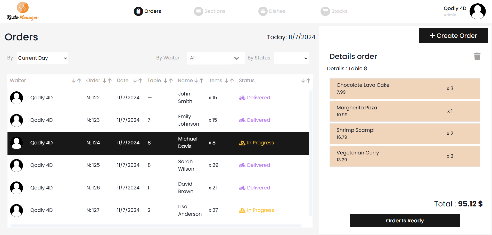
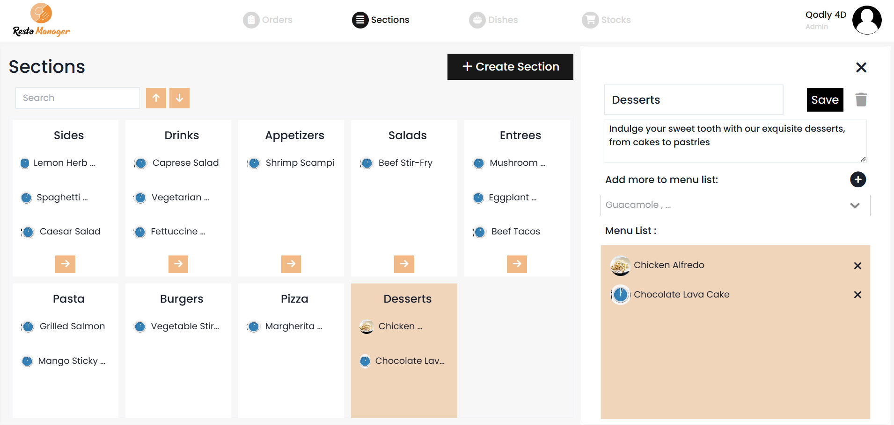
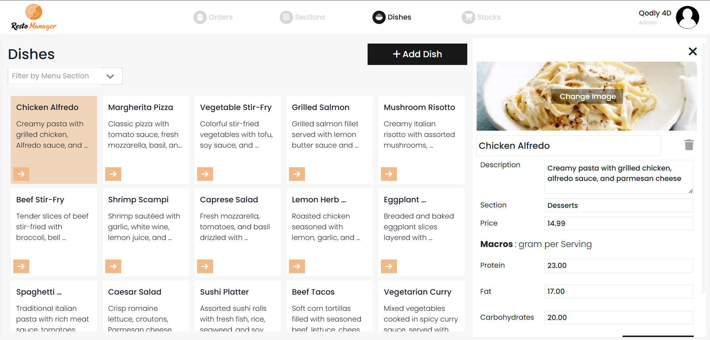
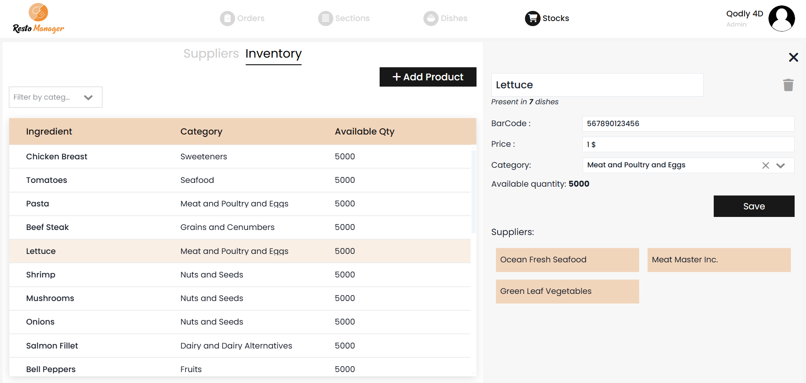

# 🍽️ Restaurant Manager Application

This demo app is built with **4D Qodly Pro** and is meant to inspire you or help you kickstart your own restaurant management project.

## Purpose

The **Restaurant Manager Application** centralizes daily restaurant operations into a single, intuitive system.  
It helps teams manage orders, menus, kitchen workflow, inventory, and suppliers while ensuring clear role-based access for staff.

## Main Features

- **Orders Management**: Create, track, and update customer orders and their statuses.

- **Menu & Sections**: Organize dishes into sections (Starters, Main Courses, Drinks, etc.).

- **Dishes Management**: Define dishes with prices, ingredients, and menu associations.

- **Inventory & Suppliers**: Track products, stock levels, and supplier information.

- **Role-Based Access**: Admin, Chef, and Waiter roles with tailored permissions.

## How to Run

### Pre-requisites (4D Software)
- Download the latest Release version of 4D: [Product Download](https://us.4d.com/product-download/Feature-Release)  
- Or the latest Beta version: [Beta Program](https://discuss.4d.com/)  
- Follow activation steps: [Installation Guide](https://developer.4d.com/docs/GettingStarted/installation)

### Steps to Run the Project
- Clone or download this repository to your local machine.
- Open the project in 4D: **File > Open Project**
- Open **Qodly Studio**: **Design > Qodly Studio**
- Click **Run** to start the server and preview the app in your browser.

## Test Accounts and Sample Data
- The application includes sample users for:
  - **Admin**
  - **Chef**
  - **Waiter**
- Sample data can be generated via a dedicated data generator method or from the UI (page Home).

## Where to Find the Code for Each Feature

- **Authentication & Roles**
  - Server: `DataStore.4dm` (authentication & session privileges)
  - UI: `startPage.WebForm` / `loginPage.WebForm`

- **Orders**
  - UI: `ordersPage.WebForm`, `newOrder.WebForm`,`orderDetails.WebForm`
  - Server/Data: `Order.4dm`, `OrderEntity.4dm`,`OrderDishEntity.4dm`,`FactureEntity.4dm`.`Waiter.4dm`

- **Menus & Sections**
  - UI: `menusPage.WebForm`, `menuDetails.WebForm` , `newMenu.WebForm`
  - Server/Data: `MenuSection.4dm`, `MenuSectionEntity.4dm`

- **Dishes**
  - UI: `dishesPage.WebForm`,`newDish.WebForm`,`dishDetails.WebForm`
  - Server/Data: `Dish.4dm`,`DishEntity.4dm`,`DishSelection.4dm`,`DishProductEntity.4dm`

- **Inventory & Suppliers**
  - UI: `stocksPage.WebForm`,`supplierDetails.WebForm`,`inventoryDetails.WebForm`,`newSupplier.WebForm`,`newProduct.WebForm`,
  - Server/Data: `Product.4dm`, `ProductEntity.4dm`,`ProductSupplierEntity.4dm`,`Supplier.4dm`,`SupplierEntity.4dm`

This structure allows you to easily customize, extend, or reuse the Restaurant Manager application as a foundation for your own food service solutions.
